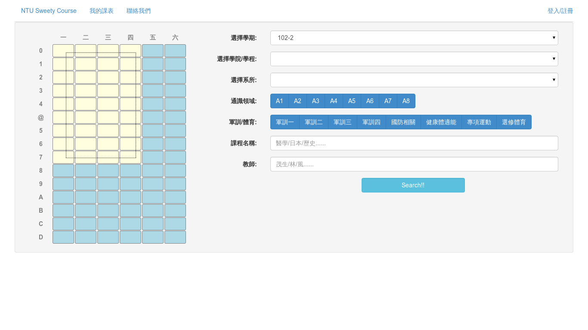
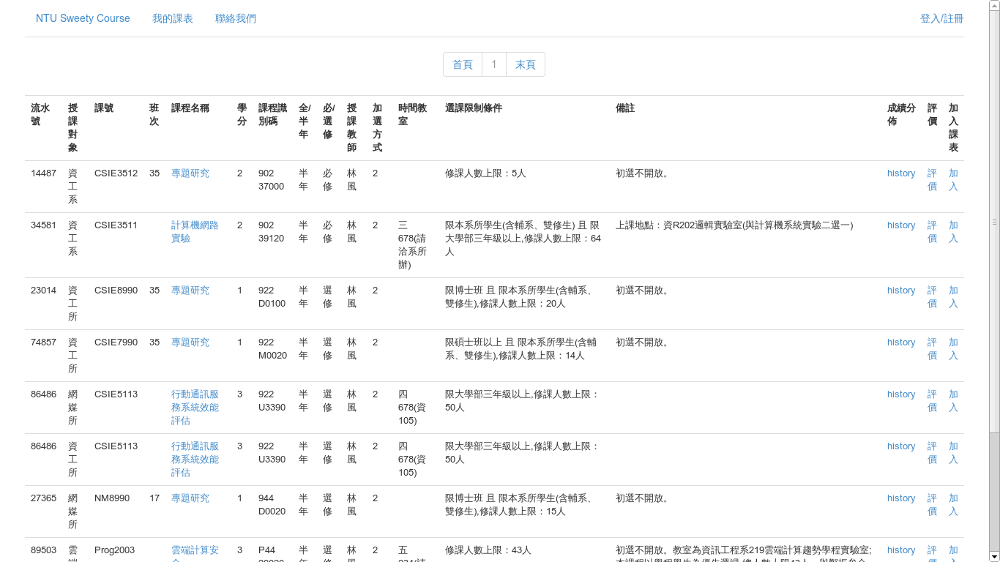
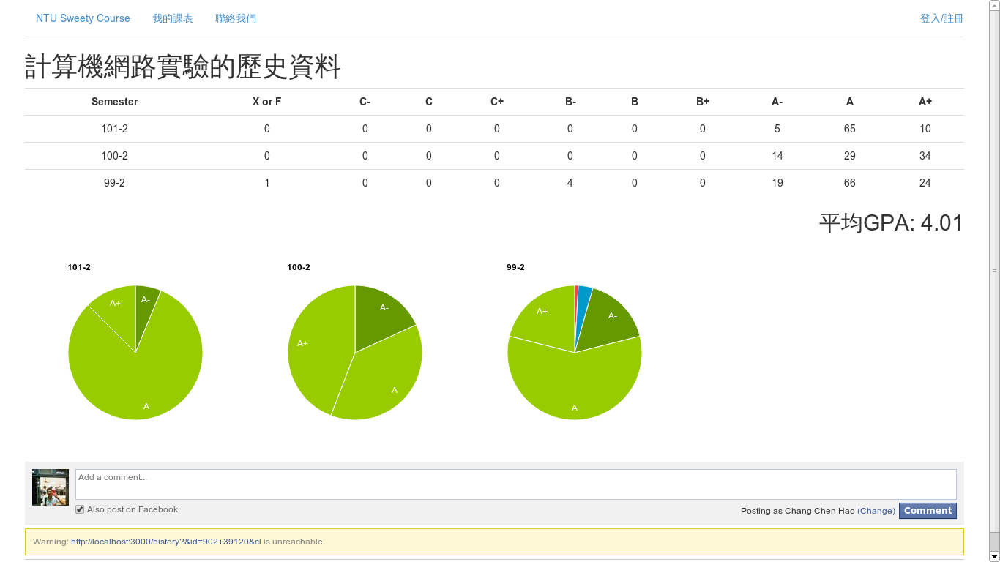
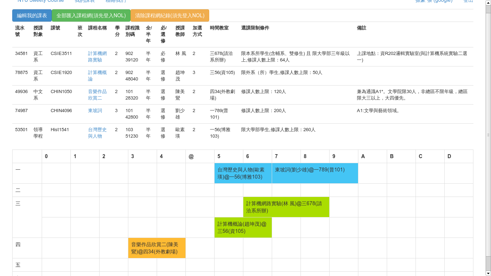
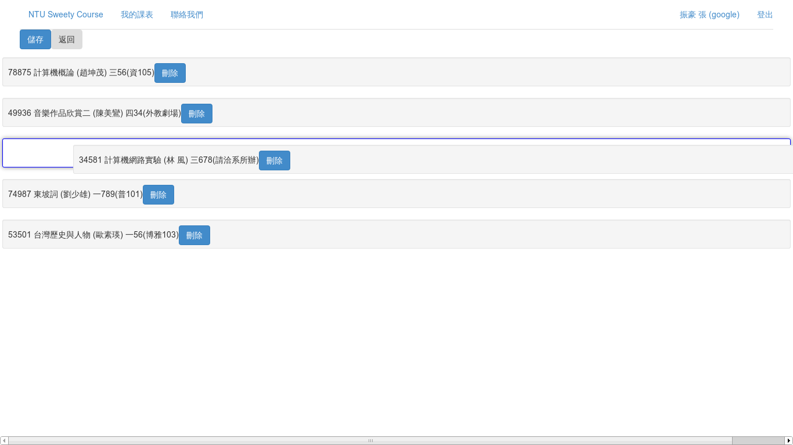

NTU Sweety Course
=================
102-2 CNL Final Project - Team 2

[Our website on heroku](http://ntusweety.herokuapp.com/)

##Team Member

1. [gau820827(b00902088 高翊祥)](https://github.com/gau820827):
Soul Man.

2. [joshzngf(b00902084 莊弘義)](https://github.com/joshzngf):
Some fancy effects of front-end, like scheduling.

3. [younger50(B00902082 謝元崵)](https://github.com/younger50):
Recommendation System. Extract course data from NTU Epo.

4. [cchao28(B00902041 張振豪)](https://github.com/cchao):
Contruct the backend of node.js and express.js. Extract data from NTU Epo and NTU NOL.

5. [laba15454(B00902030 江洵安)](https://github.com/laba15454):
Membership, login and database.

##Introduction

NTU Sweety Course is an useful tool that helps you analyze the grading of some courses.

The data is open but most students don't know it.
Besides, it's very hard to analyze the meaning behind it.

To save everyone in NTU, we create this useful tool.

##Features

1. User friendly interface. You can filter the courses by your free time.

2. Efficient server that reponse quickly.

3. Show the percentages of every rank with [Google Charts](https://developers.google.com/chart/?hl=zh-tw)

4. Calculate average GPA of some course.

5. Leave a comment to some course.

6. Recommend you a course to take.

##Technical Details

###Back-end

- [node.js](http://nodejs.org/)

- [express.js](http://expressjs.com/)

- [mongodb](http://www.mongodb.org/)

###Front-end

- [jade](http://jade-lang.com/)

- [coffeescript](http://coffeescript.org/)

- [stylus](http://learnboost.github.io/stylus/)

- [Google Custom Search](https://developers.google.com/custom-search/)

- [Google Charts](https://developers.google.com/chart/?hl=zh-tw)

- [Bootstrap 3](http://getbootstrap.com/)

- [jQuery](http://jquery.com/)

- [jQuery UI](http://jqueryui.com/)

###Preprocessing

1. Extract data from [nol.ntu.edu.tw](http://nol.ntu.edu.tw/nol/guest/index.php), we need to handle `500 error` sometimes.

2. Extract data from [ntu epo](https://if163.aca.ntu.edu.tw/eportfolio/), so that we can get courses data from open epo.

3. **The most important!!**, extract all ranks distribution from ntu epo.

##Demo

- The home page, containg the query form.

- The results are placed in a very simple table, which helps your reading very much.

- The history page, showing the data with table and charts. And you can leave a comment here.

- The schedule table is very simple and beautiful. And you can export your courses to NTU NOL.

- You can drag and drop to schedule the priority. Scheduling your courses becomes very easy.

##Relative Works

1. [選課輔助程式](http://ntucourse.ericyu.org/index.php), its [github repository](https://github.com/ericyu/ntucourse)

2. [臺灣大學歷年成績分配查詢系統](http://if163.aca.ntu.edu.tw/eportfolio/B01701130/custom_menu/grade.html)